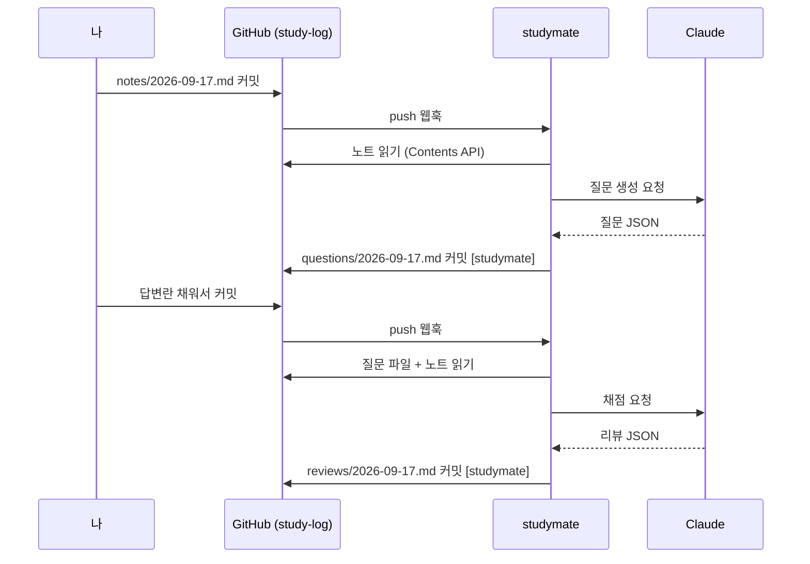

# studymate

매일 공부한 내용을 GitHub 에 커밋하면, 봇이 **이해도 확인 질문**을 커밋으로 남기고
답변을 커밋하면 **채점 + 보충 설명**을 다시 커밋해주는 학습 보조 서버.

## 목차

- [동작 흐름](#동작-흐름)
- [공부 저장소 구조](#공부-저장소-구조)
- [기술 스택](#기술-스택)
- [실행 방법](#실행-방법)
- [설정](#설정)
- [프로젝트 구조](#프로젝트-구조)
- [다음 단계](#다음-단계)

## 동작 흐름



| 변경된 파일 | 조건 | 동작 |
|---|---|---|
| `notes/*.md` | 사람이 만든 커밋 | 질문 생성 → `questions/` 커밋 |
| `questions/*.md` | 답변란이 하나 이상 채워짐 | 채점 → `reviews/` 커밋 |
| 그 외 | — | 무시 |

루프 방지: 봇 커밋은 `[studymate]` 접두어가 붙고, 핸들러는 그 커밋의 변경 파일을 무시한다.
같은 답변을 두 번 채점하지 않도록 리뷰 파일 헤더에 답변 해시를 기록한다.

## 공부 저장소 구조

봇이 감시하는 저장소(예: `study-log`)는 이 구조만 지키면 된다.

```
study-log/
├── notes/       2026-09-17.md   ← 내가 쓰는 공부 내용
├── questions/   2026-09-17.md   ← 봇이 생성, 내가 답변란을 채움
└── reviews/     2026-09-17.md   ← 봇이 생성한 피드백
```

질문 파일의 답변란:

```markdown
## Q1. (concept) 트랜잭션 격리 수준 중 REPEATABLE READ 에서 팬텀 리드가 생기는 이유는?
<!-- answer -->
여기에 답을 적고 커밋
<!-- /answer -->
```

## 기술 스택

| 항목 | 선택 |
|---|---|
| 런타임 | Java 21, Spring Boot 4.1 |
| HTTP 클라이언트 | Spring `RestClient` → GitHub Contents API |
| LLM | Anthropic Java SDK, 구조화 출력(`output_config`)으로 JSON 을 record 에 직접 매핑 |
| 빌드 | Gradle 9 |

API 키가 없으면 `DummyStudyLlm` 이 대신 동작해 파이프라인만 검증할 수 있다.

## 실행 방법

### 1. 공부 저장소 준비

GitHub 에 `study-log` 저장소를 만들고 `notes/` 폴더에 첫 노트를 커밋한다.

### 2. 서버 실행

```bash
cp .env.example .env   # 값 채우기
set -a; source .env; set +a
./gradlew bootRun
```

### 3. 웹훅 연결

로컬에서 개발할 땐 터널이 필요하다.

```bash
ngrok http 8080     # 또는 cloudflared tunnel --url http://localhost:8080
```

GitHub 저장소 → Settings → Webhooks → Add webhook

| 항목 | 값 |
|---|---|
| Payload URL | `https://<터널주소>/webhook/github` |
| Content type | `application/json` |
| Secret | `GITHUB_WEBHOOK_SECRET` 과 동일 |
| Events | Just the push event |

추가 직후 ping 이벤트가 오고 `pong` 이 응답되면 연결된 것이다.

### 4. 테스트

```bash
./gradlew test
```

## 설정

`application.yml` 의 `studymate.*` 항목. 환경변수로 덮어쓴다.

| 키 | 환경변수 | 기본값 | 설명 |
|---|---|---|---|
| `github.owner` | `GITHUB_OWNER` | — | 공부 저장소 소유자 |
| `github.repo` | `GITHUB_REPO` | — | 공부 저장소 이름 |
| `github.branch` | `GITHUB_BRANCH` | `main` | 감시할 브랜치 |
| `github.token` | `GITHUB_TOKEN` | — | Contents 읽기·쓰기 권한 PAT |
| `github.webhook-secret` | `GITHUB_WEBHOOK_SECRET` | 없음 | 비우면 서명 검증 생략 |
| `claude.api-key` | `ANTHROPIC_API_KEY` | 없음 | 비우면 더미 LLM |
| `claude.model` | — | `claude-opus-5` | 사용할 모델 |
| `study.question-count` | — | `4` | 노트당 질문 개수 |

## 프로젝트 구조

```
src/main/java/io/studymate/
├── webhook/   GithubWebhookController, WebhookSignatureVerifier, PushEvent
├── study/     PushEventHandler(분기), QuestionService, ReviewService,
│              QuestionDocument·ReviewDocument(마크다운 파싱/렌더), StudyPaths
├── github/    GithubClient (Contents API 읽기·쓰기)
├── llm/       StudyLlm 인터페이스, ClaudeStudyLlm, DummyStudyLlm, 입출력 record
└── config/    StudyMateProperties, LlmConfig, CommitMarker
src/main/resources/prompts/   question.md, review.md (시스템 프롬프트)
```

## 다음 단계

- [ ] `ANTHROPIC_API_KEY` 연결 후 실제 질문·채점 품질 튜닝 (프롬프트는 `resources/prompts/`)
- [ ] 노트가 수정됐을 때 기존 질문 파일에 질문 추가
- [ ] 주간 복습 질문 (지난주 노트 묶어서 재출제)
- [ ] 점수 추이·미답변 목록 대시보드 (React)
- [ ] Telegram/Slack 알림
