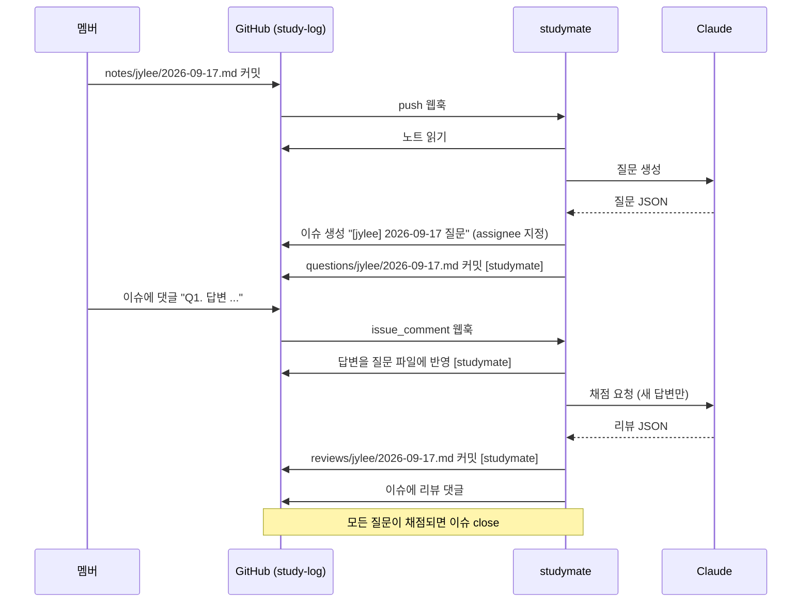

# studymate

스터디 멤버가 공부한 내용을 GitHub 에 커밋하면, 봇이 **이해도 확인 질문을 이슈로** 달고,
이슈 댓글로 답하면 **채점 + 더 알면 좋은 내용**을 다시 댓글로 달아주는 스터디 보조 서버.

## 목차

- [동작 흐름](#동작-흐름)
- [스터디 저장소 구조](#스터디-저장소-구조)
- [답변 방법](#답변-방법)
- [기술 스택](#기술-스택)
- [배포 (무료 티어)](#배포-무료-티어)
- [로컬 실행](#로컬-실행)
- [설정](#설정)
- [프로젝트 구조](#프로젝트-구조)
- [다음 단계](#다음-단계)

## 동작 흐름



| 이벤트 | 조건 | 동작 |
|---|---|---|
| push `notes/<멤버>/*.md` | 사람이 만든 커밋 | 질문 생성 → 이슈 + `questions/` 커밋 |
| push `questions/<멤버>/*.md` | 답변란이 채워짐 | 채점 → `reviews/` 커밋 + 이슈 댓글 |
| issue_comment | 질문 이슈에 `Q1.` 형식 댓글 | 답변 반영 → 채점 → 이슈 댓글 |
| 그 외 | — | 무시 |

루프 방지: 봇 커밋은 `[studymate]` 접두어, 봇 댓글은 숨은 마커(`<!-- studymate:review -->`)로 식별해 무시한다.
리뷰 파일에 질문별 답변 해시를 기록해 같은 답변을 두 번 채점하지 않는다. 답변을 고쳐 다시 올리면 그 질문만 다시 채점한다.

## 스터디 저장소 구조

봇이 감시하는 저장소(예: `study-log`)에 멤버를 collaborator 로 초대하고, 각자 자기 GitHub 아이디 폴더에 쓴다.

```
study-log/
├── notes/       jylee/2026-09-17.md   ← 멤버가 쓰는 공부 요약
├── questions/   jylee/2026-09-17.md   ← 봇이 생성, 답변이 반영됨
└── reviews/     jylee/2026-09-17.md   ← 봇이 생성한 채점·피드백
```

폴더 이름이 곧 GitHub 로그인이다. 이슈 assignee 와 @멘션에 그대로 쓰이므로 정확히 맞춰야 한다.

## 답변 방법

이슈에 댓글로, 질문 번호를 붙여 쓴다. 한 댓글에 여러 개도 되고, 나눠 써도 된다.

```
Q1. 격리 수준은 동시에 실행되는 트랜잭션끼리 얼마나 간섭할 수 있는지 정한다.
Q2. REPEATABLE READ 에서는 ...
```

`## Q1`, `**Q1:**` 같은 형식도 인식한다. 댓글을 수정하면 해당 질문만 다시 채점한다.
질문 파일의 `<!-- answer -->` 블록을 직접 채워 커밋해도 같은 흐름을 탄다.

## 기술 스택

| 항목 | 선택 |
|---|---|
| 런타임 | Java 21, Spring Boot 4.1 |
| GitHub 연동 | Spring `RestClient` → Contents API(파일), Issues API(이슈·댓글) |
| LLM | Anthropic Java SDK, 구조화 출력(`output_config`)으로 JSON 을 record 에 직접 매핑 |
| 빌드·배포 | Gradle 9, Docker (멀티스테이지), GitHub Actions CI |

API 키가 없으면 `DummyStudyLlm` 이 대신 동작해 파이프라인만 검증할 수 있다.

## 배포 (무료 티어)

Docker 이미지 하나로 어디든 뜬다. 웹훅을 받을 공개 URL 만 있으면 된다.

### Render (권장)

1. Render 대시보드 → **New → Blueprint** → 이 저장소 선택 (`render.yaml` 을 읽는다)
2. 환경변수 입력: `GITHUB_OWNER`, `GITHUB_REPO`, `GITHUB_TOKEN`, `ANTHROPIC_API_KEY`
   (`GITHUB_WEBHOOK_SECRET` 은 자동 생성됨 — 값을 복사해 둔다)
3. 배포 후 URL 확인: `https://studymate-xxxx.onrender.com/healthz` → `ok`

| 주의 | 내용 |
|---|---|
| 슬립 | 무료 플랜은 15분 요청이 없으면 잠든다. 첫 웹훅은 깨우는 데 ~30초 걸려 GitHub 쪽에 timeout 으로 찍히지만, 요청은 서버가 뜬 뒤 처리된다. 안 됐으면 웹훅 설정의 **Redeliver** 를 누른다. |
| 메모리 | 512MB. `Dockerfile` 의 `JAVA_TOOL_OPTIONS` 가 그에 맞춰져 있다. |

### 다른 선택지

| 플랫폼 | 비고 |
|---|---|
| Koyeb | 무료 1 서비스, Dockerfile 자동 인식. 슬립 없음 |
| Oracle Cloud Always Free | VM 에 `docker run`. 가장 안정적이지만 세팅이 길다 |

### GitHub 설정

1. **PAT**: study-log 저장소에 Contents·Issues 쓰기 권한 (classic 이면 `repo` 스코프)
2. **웹훅**: study-log 저장소 → Settings → Webhooks → Add webhook

| 항목 | 값 |
|---|---|
| Payload URL | `https://<서버주소>/webhook/github` |
| Content type | `application/json` |
| Secret | `GITHUB_WEBHOOK_SECRET` 과 동일 |
| Events | **Let me select** → `Pushes`, `Issue comments` |

추가 직후 ping 이벤트가 오고 `pong` 이 응답되면 연결된 것이다.

## 로컬 실행

```bash
cp .env.example .env   # 값 채우기
set -a; source .env; set +a
./gradlew bootRun

# 웹훅을 받으려면 터널
ngrok http 8080        # 또는 cloudflared tunnel --url http://localhost:8080
```

```bash
./gradlew test                       # 단위 테스트
docker build -t studymate . && docker run --env-file .env -p 8080:8080 studymate
```

## 설정

`application.yml` 의 `studymate.*` 항목. 환경변수로 덮어쓴다.

| 키 | 환경변수 | 기본값 | 설명 |
|---|---|---|---|
| `github.owner` | `GITHUB_OWNER` | — | 스터디 저장소 소유자 |
| `github.repo` | `GITHUB_REPO` | — | 스터디 저장소 이름 |
| `github.branch` | `GITHUB_BRANCH` | `main` | 감시할 브랜치 |
| `github.token` | `GITHUB_TOKEN` | — | Contents·Issues 쓰기 권한 PAT |
| `github.webhook-secret` | `GITHUB_WEBHOOK_SECRET` | 없음 | 비우면 서명 검증 생략 |
| `claude.api-key` | `ANTHROPIC_API_KEY` | 없음 | 비우면 더미 LLM |
| `claude.model` | — | `claude-opus-5` | 사용할 모델 |
| `study.question-count` | — | `4` | 노트당 질문 개수 |
| `server.port` | `PORT` | `8080` | 호스팅 플랫폼이 주입 |

웹훅 처리는 단일 스레드로 직렬화된다(`spring.task.execution`). 같은 파일을 동시에 커밋해 충돌 나는 것을 막기 위함이며, 스터디 규모에서는 충분하다.

## 프로젝트 구조

```
src/main/java/io/studymate/
├── webhook/   GithubWebhookController(진입·분기), WebhookSignatureVerifier,
│              PushEvent·IssueCommentEvent(페이로드), HealthController
├── study/     PushEventHandler·IssueCommentHandler(이벤트 → 서비스),
│              QuestionService(질문 생성·이슈), ReviewService(채점·댓글·close),
│              QuestionDocument·ReviewDocument(마크다운 파싱/렌더),
│              CommentAnswers(댓글 답변 파싱), IssueMarkdown(이슈 본문·마커), StudyKey·StudyPaths
├── github/    GithubClient (Contents API, Issues API)
├── llm/       StudyLlm 인터페이스, ClaudeStudyLlm, DummyStudyLlm, 입출력 record
└── config/    StudyMateProperties, LlmConfig, CommitMarker
src/main/resources/prompts/   question.md, review.md (시스템 프롬프트)
```

## 다음 단계

- [ ] GitHub Pages 대시보드 — `reviews/` 를 읽어 멤버별 점수 추이·미답변 현황 (정적 사이트, Actions 로 배포)
- [ ] 주간 복습 — 지난주 노트를 묶어 재출제
- [ ] 노트가 수정됐을 때 기존 이슈에 질문 추가
- [ ] Telegram/Slack 알림
